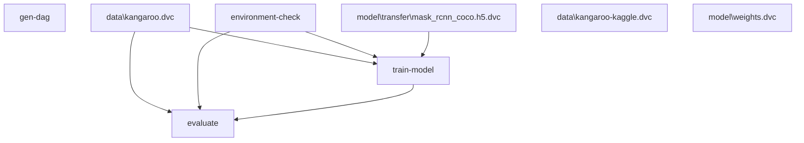
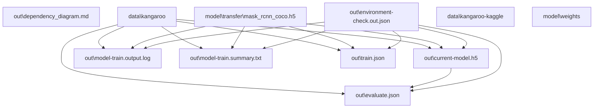

```mermaid
flowchart TD
	node1["gen-dag"]
	node2["data\kangaroo.dvc"]
	node3["environment-check"]
	node4["evaluate"]
	node5["model\transfer\mask_rcnn_coco.h5.dvc"]
	node6["train-model"]
	node2-->node4
	node2-->node6
	node3-->node4
	node3-->node6
	node5-->node6
	node6-->node4
	node7["data\kangaroo-kaggle.dvc"]
	node8["model\weights.dvc"]
```

```mermaid
flowchart TD
	node1["out\dependency_diagram.md"]
	node2["data\kangaroo"]
	node3["model\transfer\mask_rcnn_coco.h5"]
	node4["out\current-model.h5"]
	node5["out\environment-check.out.json"]
	node6["out\evaluate.json"]
	node7["out\model-train.output.log"]
	node8["out\model-train.summary.txt"]
	node9["out\train.json"]
	node2-->node4
	node2-->node6
	node2-->node7
	node2-->node8
	node2-->node9
	node3-->node4
	node3-->node7
	node3-->node8
	node3-->node9
	node4-->node6
	node5-->node4
	node5-->node6
	node5-->node7
	node5-->node8
	node5-->node9
	node10["data\kangaroo-kaggle"]
	node11["model\weights"]
```
